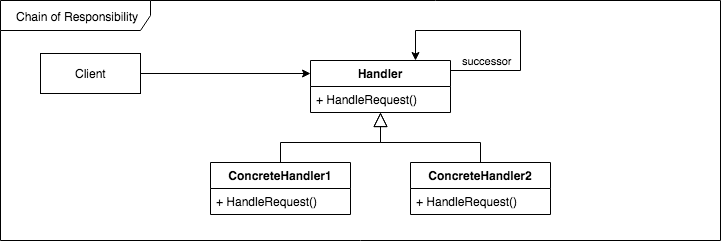

# Design-Patterns
This is a collection of software design patterns from the well known "Design Patterns : Elements of Reusable Object-Oriented Software" book implemented in python.

The main motivation for this proyect is for people to learn and compare programming languages while implementing these software patterns.

The code implementations differ from the book and include documentation specific to the language being used. To find a specific language implementation search for the 'Examples' section on each pattern page, right below the UML diagram.

## Clasification

Below are the patterns classified by scope and purpose. The first one specifies whether the pattern applies primarily to classes or objects while the second one reflects if they have either creational, structural or behavioral purpose.

### Class

Creational           | Structural   | Behavioral
:------------------: | ------------ | -------------------
[Factory Method][10] | [Adapter][2] | [Interpreter][12]
|                    |              | [Template Method][22]

### Object

Creational             | Structural      | Behavioral
:--------------------: | --------------- | ---------
[Abstract Factory][1]  | [Adapter][2]    | [Chain of Responsibility][5]
[Builder][4]           | [Bridge][3]     | [Command][6]
[Prototype][17]        | [Composite][7]  | [Iterator][13]
[Singleton][19]        | [Decorator][8]  | [Mediator][14]
|                      | [Facade][9]     | [Memento][15]
|                      | [Flyweight][11] | [Observer][16]
|                      | [Proxy][18]     | [State][20]
|                      |                 | [Strategy][21]
|                      |                 | [Visitor][23]

## [Behavioral](./readmes/behavioral.md)
Pattern                      | Intent | UML
:--------------------------: | ------ | ------
[Chain of Responsibility][5] | Object can fullfill a request.                                                | 
[Command][6]                 | When and how a request is fullfilled.                                         | 
[Interpreter][12]            | Grammar and interpretation of a language.                                     | 
[Iterator][13]               | How an aggregate's elements are traversed.                                    | 
[Mediator][14]               | How and which objects interact with each other.                               | 
[Memento][15]                | What and when private information is stored outside an object.                | 
[Observer][16]               | How dependent objects stay up to date.                                        | 
[State][20]                  | States of an object.                                                          | 
[Strategy][21]               | An algorithm.                                                                 | 
[Template Method][22]        | Steps of an algorithm.                                                        | 
[Visitor][23]                | Operations that can be applied to object(s) without changing their class(es). | 

## [Creational](./readmes/creational.md)
Pattern          | Intent | UML
:---------------------------------------: | ------ | ------
[Abstract Factory](./readmes/abstract.md) | Families of product objects.             | 
[Builder](./readmes/builder.md)           | How a composite object gets created.     | 
[Factory Method](./readmes/factory.md)    | Subclass of object that is instantiated. | 
[Prototype](./readmes/prototype.md)       | Class of object that is instantiated.    | 
[Singleton](./readmes/singleton.md)       | The sole instance of a class.            | 

## [Structural](./readmes/structural.md)
Pattern                             | Intent | UML
:---------------------------------: | ------ | ------
[Adapter](./readmes/adapter.md)     | Interface of an object.                        | 
[Bridge](./readmes/bridge.md)       | Implementation of an object.                   | 
[Composite](./readmes/composite.md) | Structure and composition without subclassing. | 
[Decorator](./readmes/decorator.md) | Responsibilities without subclassing.          | 
[Facade](./readmes/facade.md)       | Interface to a subsystem.                      | 
[Flyweight](./readmes/flyweight.md) | Storage costs of objects.                      | 
[Proxy](./readmes/proxy.md)         | How an object's location is accessed.          | 

[1]: ./readmes/abstract.md
[2]: ./readmes/adapter.md
[3]: ./readmes/bridge.md
[4]: ./readmes/builder.md
[5]: ./readmes/chain.md
[6]: ./readmes/command.md
[7]: ./readmes/composite.md
[8]: ./readmes/decorator.md
[9]: ./readmes/facade.md
[10]: ./readmes/factory.md
[11]: ./readmes/flyweight.md
[12]: ./readmes/interpreter.md
[13]: ./readmes/iterator.md
[14]: ./readmes/mediator.md
[15]: ./readmes/memento.md
[16]: ./readmes/observer.md
[17]: ./readmes/prototype.md
[18]: ./readmes/proxy.md
[19]: ./readmes/singleton.md
[20]: ./readmes/state.md
[21]: ./readmes/strategy.md
[22]: ./readmes/template.md
[23]: ./readmes/visitor.md

## References
1. Gamma, Erich, et al. Design Patterns : Elements of Reusable Object-Oriented Software. Machinery Industry, 2003.
