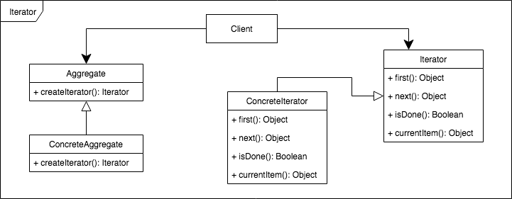

# Behavioral Patterns

Pattern                 | UML
:---------------------: | ------
Chain of Responsibility | 
Command                 | 
Interpreter             | 
Iterator                | 
Mediator                | 
Memento                 | 
Observer                | 
State                   | 
Strategy                | 
Template Method         | 
Visitor                 | 

