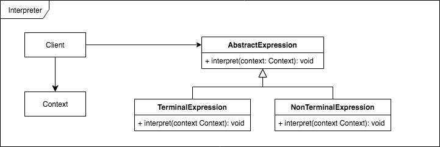

# [Design Patterns](./README.md)
## Behavioral Patterns

Pattern                 | UML | code
:---------------------: | --- | ----
Chain of Responsibility |  | [python](./python3/behavioral/chain)
Command                 |                | [python](./python3/behavioral/command)
Interpreter             |        | [python](./python3/behavioral/interpreter)
Iterator                |              | [python](./python3/behavioral/iterator)
Mediator                |              | [python](./python3/behavioral/mediator)
Memento                 |                | [python](./python3/behavioral/memento)
Observer                |              | [python](./python3/behavioral/observer)
State                   |                    | [python](./python3/behavioral/state)
Strategy                |              | [python](./python3/behavioral/strategy)
Template Method         |       | [python](./python3/behavioral/template)
Visitor                 |                | [python](./python3/behavioral/visitor)

