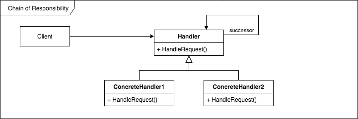

# [Design Patterns](../../README.md)
## [Behavioral Patterns](../../../readmes/behavioral.md)
### Chain of Responsibility



```
class Handler:
    pass
```
* Defines an interface for handling requests.

```
class ConcreteHandler:
    pass
```
* Handles the requests it is responsible for.
  * If it can't handle it, it sends it to its successor.

```
class Client:
    pass
```
* Sends commands to the root of the chain.

### Examples
1. [Pipeline](./pipeline.py) - Send a product request into a chain of handlers.

#### Related Patterns
* [Command](../command) - Chain of Responsibility can use Command to represent requests as objects.
* [Composite](../composite) - Component parents can act as successors.
