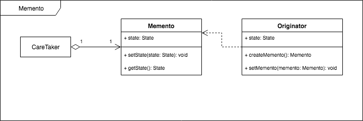

# [Design Patterns](../../README.md)
## [Behavioral Patterns](../../../readmes/behavioral.md)
### Memento



```
class Memento:

    def __init__(self):
        self.state = State()

    def setState(self, state):
        self.state = SerializedState(state)

    def getState(self):
        return self.state
```
* Stores internal state of the Originator object. The state can include any number of state variables.
* The Memento must have two interfaces; one to the CareTaker and one to the Originator.
    * The CarteTaker should not be allowed any operations or access to the stored state, thus honoring encapsulation.
    * The Oritinator should be allowed to access any state variables necessary to restore previous state.

```
class Originator:

    def __init__(self):
        self.__state = None

    def createMemento(self):
        memento = Memento()
        memento.setState(self.__state)
        return memento

    def setMemento(self, memento):
        self.__state = DeserializeState(memento.getState())

    def operation(self):
        pass
```
* Creates a memento object that captures the originator's internal state.
* Uses the memento object to restore its previous state.

```
class CareTaker:

    def main(self):
        o = Originator()
        m = o.createMemento()
        # o.operation1()
        # o.operation2()
        # ...
        o.setMemento(m)
```
* Responsible for keeping the memento.
* The memento is opaque to the CareTaker, and the CareTaker must not operate on it.

### Examples
1. [Undo](./undo.py)


### Related Patterns
* [Command Pattern](../command) - Commands can make use of mementos to support undoable operations.
